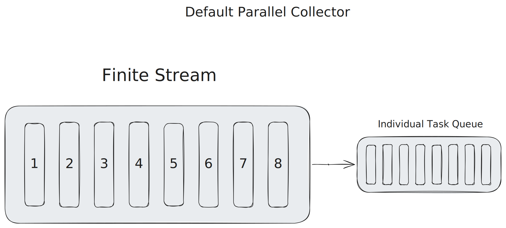
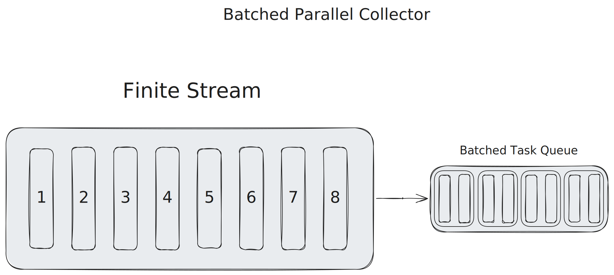

# Java Stream API Virtual-Threads-enabled Parallel Collectors
Overcoming limitations of standard Parallel Streams

[](https://github.com/pivovarit/parallel-collectors/actions/workflows/build.yml)
[](http://pivovarit.github.io/parallel-collectors)
[](https://central.sonatype.com/artifact/com.pivovarit/parallel-collectors/versions)


[](https://starchart.cc/pivovarit/parallel-collectors)

Parallel Collectors is a toolkit that eases parallel collection processing in Java using the Stream API without the limitations imposed by standard Parallel Streams.

    list.stream()
      .collect(parallel(i -> blockingOp(i), toList()))
        .orTimeout(1000, MILLISECONDS)
        .thenAcceptAsync(System.out::println, executor)
        .thenRun(() -> System.out.println("Finished!"));
      
They are:
- lightweight, defaulting to Virtual Threads (an alternative to Project Reactor for scenarios where a lighter solution is preferred)
- powerful (the combined power of Stream API and `CompletableFuture`s, allowing for timeout specification, composition with other `CompletableFuture`s, and asynchronous processing)
- configurable (flexibility with customizable `Executor`s and _parallelism_ levels)
- non-blocking (eliminates the need to block the calling thread while awaiting results)
- short-circuiting (if one of the operations raises an exception, the remaining tasks will get interrupted)  
- non-invasive (they are just custom implementations of `Collector` interface, no magic inside, zero-dependencies, no Stream API internals hacking)
- versatile (enables easy integration with existing Stream API `Collectors`)

### Maven Dependencies

#### JDK 21+:

    <dependency>
        <groupId>com.pivovarit</groupId>
        <artifactId>parallel-collectors</artifactId>
        <version>3.3.0</version>
    </dependency>

#### JDK 8+:

    <dependency>
        <groupId>com.pivovarit</groupId>
        <artifactId>parallel-collectors</artifactId>
        <version>2.6.1</version>
    </dependency>

##### Gradle

#### JDK 21+:

    implementation 'com.pivovarit:parallel-collectors:3.3.0'

#### JDK 8+:

    implementation 'com.pivovarit:parallel-collectors:2.6.1'

## Philosophy

Parallel Collectors are intentionally unopinionated, leaving responsibility to users for:

- Proper configuration of provided `Executor`s and their lifecycle management
- Choosing appropriate parallelism levels
- Ensuring the tool is applied in the right context

**Important:** Review the API documentation before deploying in production.

## Basic API

The main entry point is the `com.pivovarit.collectors.ParallelCollectors` class, which follows the convention established by `java.util.stream.Collectors` and features static factory methods returning custom `java.util.stream.Collector` implementations with parallel processing capabilities.

**Important Notes:**
- By design, it's obligatory to supply a custom `Executor` instance and manage its lifecycle (except for Virtual Thread variants).
- All parallel collectors are **one-off** and **must not be reused**.
- Methods without an explicit `Executor` parameter use Virtual Threads (requires Java 21+).

### Available Collectors

#### Core Collectors (Virtual Threads - Java 21+):

-  `CompletableFuture<Stream<T>> parallel(Function)` 
-  `CompletableFuture<Collection<T>> parallel(Function, Collector)` 
-  `CompletableFuture<Stream<T>> parallel(Function, parallelism)` 
-  `CompletableFuture<Collection<T>> parallel(Function, Collector, parallelism)` 

#### Core Collectors (Custom Executor):

-  `CompletableFuture<Stream<T>> parallel(Function, Executor)` 
-  `CompletableFuture<Collection<T>> parallel(Function, Collector, Executor)` 
-  `CompletableFuture<Stream<T>> parallel(Function, Executor, parallelism)`
-  `CompletableFuture<Collection<T>> parallel(Function, Collector, Executor, parallelism)`

#### Streaming Collectors (Virtual Threads - Java 21+):

-  `Stream<T> parallelToStream(Function)` 
-  `Stream<T> parallelToOrderedStream(Function)` 
-  `Stream<T> parallelToStream(Function, parallelism)` 
-  `Stream<T> parallelToOrderedStream(Function, parallelism)` 

#### Streaming Collectors (Custom Executor):

-  `Stream<T> parallelToStream(Function, Executor)`
-  `Stream<T> parallelToOrderedStream(Function, Executor)`
-  `Stream<T> parallelToStream(Function, Executor, parallelism)`
-  `Stream<T> parallelToOrderedStream(Function, Executor, parallelism)`

#### Batching Collectors

By default, all `ExecutorService` threads _compete_ for each task separately, resulting in a basic form of _work-stealing_. While this approach can decrease processing time for subtasks with varying durations, it comes with overhead.

However, if the processing time for all subtasks is similar, it's often better to distribute tasks in batches to avoid excessive contention.

For example, processing 1000 tasks with two threads will result in 1000 tasks being submitted to the thread pool, where two threads compete for the same task queue:

[](docs/default.svg)

Batching allows converting this into two tasks, each with 500 subtasks:

[](docs/batched.svg)

The difference in performance can be significant:

```plain
Benchmark                              Mode  Cnt      Score     Error  Units
BatchedVsNonBatchedBenchmark.batch    thrpt    5  41558.548 ± 959.057  ops/s
BatchedVsNonBatchedBenchmark.normal   thrpt    5    254.869 ±   5.667  ops/s
```

Batching alternatives are available under the `ParallelCollectors.Batching` namespace.

#### Normal


#### Batched


### Leveraging CompletableFuture

Parallel Collectors expose results wrapped in `CompletableFuture` instances, providing great flexibility and enabling non-blocking operations:

    CompletableFuture<List<String>> result = list.stream()
      .collect(parallel(i -> foo(i), toList(), executor));

This makes it possible to conveniently apply callbacks and compose with other `CompletableFuture`s:

    list.stream()
      .collect(parallel(i -> foo(i), toSet(), executor))
      .thenAcceptAsync(System.out::println, otherExecutor)
      .thenRun(() -> System.out.println("Finished!"));
      
Or just `join()` if you want to block the calling thread and wait for the result:

    List<String> result = list.stream()
      .collect(parallel(i -> foo(i), toList(), executor))
      .join();
      
What's more, since JDK 9, [you can even provide your own timeout easily](https://docs.oracle.com/en/java/javase/11/docs/api/java.base/java/util/concurrent/CompletableFuture.html#orTimeout(long,java.util.concurrent.TimeUnit)):

    list.stream()
      .collect(parallel(i -> foo(i), toList(), executor))
      .orTimeout(1000, MILLISECONDS)
      .join();
      
## Examples

##### 1. Apply `i -> foo(i)` in parallel using Virtual Threads and collect to `List`

    CompletableFuture<List<String>> result = list.stream()
      .collect(parallel(i -> foo(i), toList()));
      
##### 2. Apply `i -> foo(i)` in parallel on a custom `Executor` and collect to `List`

    Executor executor = ...

    CompletableFuture<List<String>> result = list.stream()
      .collect(parallel(i -> foo(i), toList(), executor));
      
##### 3. Apply `i -> foo(i)` in parallel on a custom `Executor` with max parallelism of 4 and collect to `Set`

    Executor executor = ...

    CompletableFuture<Set<String>> result = list.stream()
      .collect(parallel(i -> foo(i), toSet(), executor, 4));
      
##### 4. Apply `i -> foo(i)` in parallel on a custom `Executor` and collect to `LinkedList`

    Executor executor = ...

    CompletableFuture<List<String>> result = list.stream()
      .collect(parallel(i -> foo(i), toCollection(LinkedList::new), executor));
      
##### 5. Apply `i -> foo(i)` in parallel on a custom `Executor` and stream results in completion order

    Executor executor = ...

    list.stream()
      .collect(parallelToStream(i -> foo(i), executor))
      .forEach(i -> ...);
      
##### 6. Apply `i -> foo(i)` in parallel on a custom `Executor` and stream results in the original order

    Executor executor = ...

    list.stream()
      .collect(parallelToOrderedStream(i -> foo(i), executor))
      .forEach(i -> ...);
      .forEach(i -> ...);

## Rationale

Stream API is a powerful tool for collection processing, especially for parallelizing CPU-intensive tasks. For example:

    public static void parallelSetAll(int[] array, IntUnaryOperator generator) {
        Objects.requireNonNull(generator);
        IntStream.range(0, array.length).parallel().forEach(i -> { array[i] = generator.applyAsInt(i); });
    }
    
**However, Parallel Streams execute tasks on a shared `ForkJoinPool` instance.**
 
Unfortunately, this is not the best choice for running blocking operations—even when using `ManagedBlocker`. As [explained by Tagir Valeev](https://stackoverflow.com/a/37518272/2229438), this could easily lead to saturation of the common pool and performance degradation of everything that uses it.

For example:

    List<String> result = list.parallelStream()
      .map(i -> foo(i)) // runs implicitly on ForkJoinPool.commonPool()
      .toList();

To avoid such problems, **the solution is to isolate blocking tasks** and run them on a separate thread pool—but there's a catch.

**Sadly, Streams can only run parallel computations on the common `ForkJoinPool`**, which effectively restricts their applicability to CPU-bound jobs.

However, there's a trick that allows running parallel Streams in a custom ForkJoinPool instance—but it's not considered reliable and can still induce oversubscription issues while competing with the common pool for resources.

> Note, however, that this technique of submitting a task to a fork-join pool to run the parallel stream in that pool is an implementation "trick" and is not guaranteed to work. Indeed, the threads or thread pool that is used for the execution of parallel streams is unspecified. By default, the common fork-join pool is used, but in different environments, different thread pools might end up being used. 

Says [Stuart Marks on StackOverflow](https://stackoverflow.com/questions/28985704/parallel-stream-from-a-hashset-doesnt-run-in-parallel/29272776#29272776).

Moreover, this approach was seriously flawed before JDK 10. If a `Stream` was targeted towards another pool, splitting would still adhere to the parallelism of the common pool rather than the targeted pool's parallelism [[JDK-8190974]](https://bugs.openjdk.java.net/browse/JDK-8190974).
   
### Dependencies

None - the library is implemented using core Java libraries.

### Limitations

- **Upstream `Stream` is always evaluated as a whole**, even if the following operation is short-circuiting.
This means that none of these collectors should be used with infinite streams. The design of the `Collector` API imposes this limitation.

- **Never use Parallel Collectors with `Executor`s that have a `RejectedExecutionHandler` that discards tasks**—this might result in a deadlock.

### Good Practices

- **Consider providing reasonable timeouts** for `CompletableFuture`s to avoid blocking unreasonably long when something goes wrong [(how-to)](https://docs.oracle.com/en/java/javase/11/docs/api/java.base/java/util/concurrent/CompletableFuture.html#orTimeout(long,java.util.concurrent.TimeUnit))
- **Name your thread pools**—it makes debugging easier
- **Limit the size of your thread pool's working queue** [(source)](https://mechanical-sympathy.blogspot.com/2012/05/apply-back-pressure-when-overloaded.html)
- **Limit the level of parallelism** [(source)](https://mechanical-sympathy.blogspot.com/2012/05/apply-back-pressure-when-overloaded.html)
- **A no-longer-used `ExecutorService` should be shut down** to allow reclamation of its resources
- **Keep in mind** that `CompletableFuture#then(Apply|Combine|Consume|Run|Accept)` might be executed by the calling thread. If this is not suitable, use `CompletableFuture#then(Apply|Combine|Consume|Run|Accept)Async` instead and provide a custom `Executor` instance.

## Words of Caution

While Parallel Collectors and Virtual Threads make parallelization easy, it doesn't always mean it's the best choice. Parallelism comes with overhead, and even Virtual Threads consume resources.

Before opting for parallel processing, consider addressing the root cause through alternatives such as:
- Database-level optimizations (e.g., JOIN statements, proper indexing)
- Request batching
- Data reorganization
- Choosing a more suitable API method
- Caching strategies

**Rule of thumb:** Measure before and after parallelization to ensure it actually improves performance for your use case.

----
See [CHANGELOG.MD](https://github.com/pivovarit/parallel-collectors/blob/master/CHANGELOG.MD) for a complete version history.
