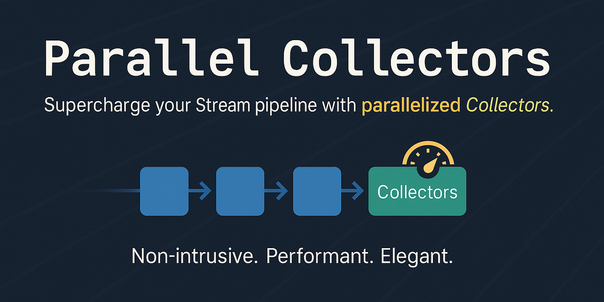
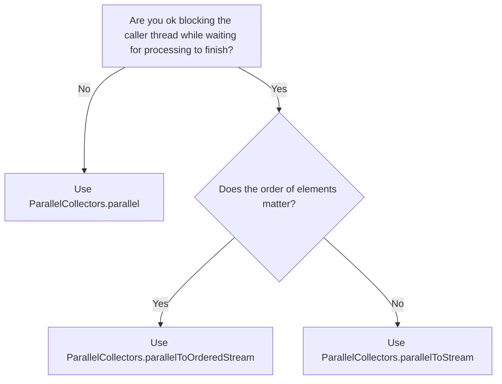
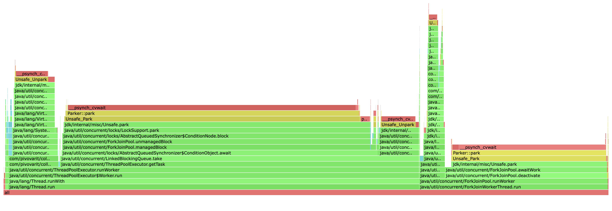
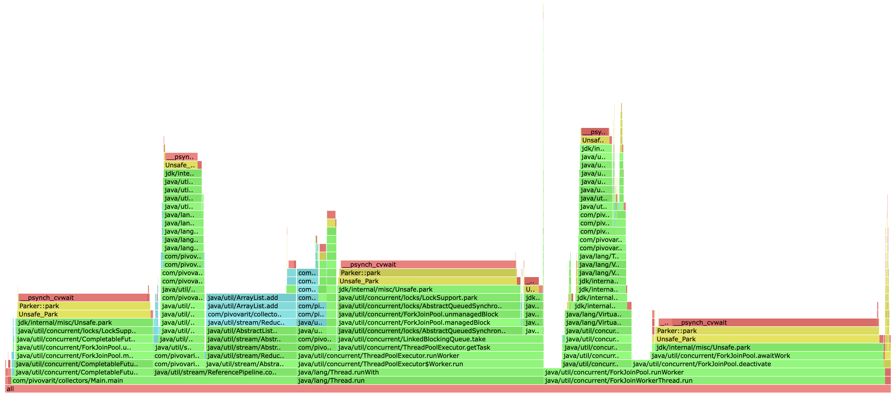

# Java Stream API Virtual-Threads-enabled Parallel Collectors
Overcoming limitations of standard Parallel Streams

[](https://github.com/pivovarit/parallel-collectors/actions/workflows/build.yml)
[](http://pivovarit.github.io/parallel-collectors)
[](https://central.sonatype.com/artifact/com.pivovarit/parallel-collectors/versions)



[](https://starchart.cc/pivovarit/parallel-collectors)

Parallel Collectors is a toolkit that eases parallel collection processing in Java using the Stream API without the limitations imposed by standard Parallel Streams.

    list.stream()
      .collect(parallel(i -> blockingOp(i), toList()))
        .orTimeout(1000, MILLISECONDS)
        .thenAcceptAsync(System.out::println, executor)
        .thenRun(() -> System.out.println("Finished!"));
      
They are:
- lightweight, defaulting to Virtual Threads (an alternative to Project Reactor for scenarios where a lighter solution is preferred)
- powerful (the combined power of Stream API and `CompletableFuture`s, allowing for timeout specification, composition with other `CompletableFuture`s, and asynchronous processing)
- configurable (flexibility with customizable `Executor`s and _parallelism_ levels)
- non-blocking (eliminates the need to block the calling thread while awaiting results)
- short-circuiting (if one of the operations raises an exception, the remaining tasks will get interrupted)  
- non-invasive (they are just custom implementations of `Collector` interface, no magic inside, zero-dependencies, no Stream API internals hacking)
- versatile (enables easy integration with existing Stream API `Collectors`)

### Maven Dependencies

#### JDK 21+:

    <dependency>
        <groupId>com.pivovarit</groupId>
        <artifactId>parallel-collectors</artifactId>
        <version>3.4.0</version>
    </dependency>

#### JDK 8+:

    <dependency>
        <groupId>com.pivovarit</groupId>
        <artifactId>parallel-collectors</artifactId>
        <version>2.6.1</version>
    </dependency>

##### Gradle

#### JDK 21+:

    implementation 'com.pivovarit:parallel-collectors:3.4.0'`

#### JDK 8+:

    implementation 'com.pivovarit:parallel-collectors:2.6.1'`

## Philosophy

Parallel Collectors are intentionally unopinionated, leaving responsibility to users for:

- Proper configuration of provided `Executor`s and their lifecycle management
- Choosing appropriate parallelism levels
- Ensuring the tool is applied in the right context

Review the API documentation before deploying in production.

## Why This Exists?

The goal is to use the Stream API without inheriting the limitations of parallel streams, especially for I/O-heavy or structured workloads.

Java's built-in parallelization story is geared toward CPU-bound workloads - `parallelStream()` runs everything on the shared ForkJoinPool, which makes it a poor fit for blocking I/O, remote calls, database access, or anything that can stall a worker thread. Once that pool is saturated, everything else using it slows down as well.

This library fills that gap. It keeps the Stream API model but replaces the execution strategy:
- user-provided executors instead of the common pool
- virtual-thread defaults for low-overhead concurrency
- classification and batching for further scheduling fine-tuning
- `CompletableFuture` integration so you can work asynchronously and apply timeouts, callbacks, or composition naturally

## Basic API

The main entry point is the `com.pivovarit.collectors.ParallelCollectors` class - which follows the convention established by `java.util.stream.Collectors` and features static factory methods returning custom `java.util.stream.Collector` implementations spiced up with parallel processing capabilities.

By default, collectors use Virtual Threads, but you can optionally provide a custom `Executor` instance for more control. When using a custom `Executor`, you are responsible for its lifecycle management.

All parallel collectors are one-off and must not be reused.

## Choosing the Right Collector



`ParallelCollectors.parallel` family returns `CompletableFuture` while `ParallelCollectors.parallelToStream` family returns `Stream`.

Additionally, you can customize:
- a custom `Executor` (defaults to Virtual Threads)
- a custom parallelism level
- batching by key via `*By(...)` methods
- batching by size via `Batching` namespace
- a custom `Collector` (`ParallelCollectors.parallel` only)

#### Batching Collectors
When you use non-batching parallel collectors, **every input element is turned into an individual task** submitted to an `ExecutorService`. If you have 1000 elements, you end up submitting 1000 tasks. 
Even if you only have two threads processing them, both threads hammer the same task queue, repeatedly competing for the next piece of work. That competition creates contention, and overall overhead.

This behaviour resembles a primitive form of **work-stealing**, where each worker repeatedly tries to grab the next available task. **Work-stealing is great in scenarios where task durations vary significantly**, since it keeps faster workers busy, **but it's not free**.

However, if the processing time for all subtasks is similar, it might be better to distribute tasks in batches to avoid excessive contention.

Without batching:

```
Thread 1: [] [] [] [] [] [] [] [] [] [] [] ... (500 tiny tasks)
Thread 2: [] [] [] [] [] [] [] [] [] [] [] ... (500 tiny tasks)
```

With batching:
```
Thread 1: [--------------------------------------------------] (1 large task)
Thread 2: [--------------------------------------------------] (1 large task)
```

The difference in performance for lightweight tasks can be enormous:

```plain
Benchmark                              Mode  Cnt      Score     Error  Units
BatchedVsNonBatchedBenchmark.batch    thrpt    5  41558.548 ± 959.057  ops/s
BatchedVsNonBatchedBenchmark.normal   thrpt    5    254.869 ±   5.667  ops/s
```

Batching alternatives are available under the `ParallelCollectors.Batching` namespace.

#### Normal



#### Batched



### Leveraging CompletableFuture

Parallel Collectors™ expose results wrapped in `CompletableFuture` instances, which provides great flexibility and the possibility of working with them in a non-blocking fashion:

    CompletableFuture<List<String>> result = list.stream()
      .collect(parallel(i -> foo(i), toList(), executor));

This makes it possible to conveniently apply callbacks and compose with other `CompletableFuture`s:

    list.stream()
      .collect(parallel(i -> foo(i), toSet(), executor))
      .thenAcceptAsync(System.out::println, otherExecutor)
      .thenRun(() -> System.out.println("Finished!"));
      
Or just `join()` if you just want to block the calling thread and wait for the result:

    List<String> result = list.stream()
      .collect(parallel(i -> foo(i), toList(), executor))
      .join();
      
What's more, since JDK9, [you can even provide your own timeout easily](https://docs.oracle.com/en/java/javase/11/docs/api/java.base/java/util/concurrent/CompletableFuture.html#orTimeout(long,java.util.concurrent.TimeUnit)).
      
## Examples

##### 1. Apply `i -> foo(i)` in parallel on a custom `Executor` and collect to `List`

    Executor executor = ...

    CompletableFuture<List<String>> result = list.stream()
      .collect(parallel(i -> foo(i), toList(), executor));
      
##### 2. Apply `i -> foo(i)` in parallel on a custom `Executor` with max parallelism of 4 and collect to `Set`

    Executor executor = ...

    CompletableFuture<Set<String>> result = list.stream()
      .collect(parallel(i -> foo(i), toSet(), executor, 4));
      
##### 3. Apply `i -> foo(i)` in parallel on a custom `Executor` and collect to `LinkedList`

    Executor executor = ...

    CompletableFuture<List<String>> result = list.stream()
      .collect(parallel(i -> foo(i), toCollection(LinkedList::new), executor));
      
##### 4. Apply `i -> foo(i)` in parallel on a custom `Executor` and stream results in completion order

    Executor executor = ...

    list.stream()
      .collect(parallelToStream(i -> foo(i), executor))
      .forEach(i -> ...);
      
##### 5. Apply `i -> foo(i)` in parallel on a custom `Executor` and stream results in the original order

    Executor executor = ...

    list.stream()
      .collect(parallelToOrderedStream(i -> foo(i), executor))
      .forEach(i -> ...);

## Rationale

Stream API is a great tool for collection processing, especially if you need to parallelize the execution of CPU-intensive tasks, for example:

    public static void parallelSetAll(int[] array, IntUnaryOperator generator) {
        Objects.requireNonNull(generator);
        IntStream.range(0, array.length).parallel().forEach(i -> { array[i] = generator.applyAsInt(i); });
    }
    
**However, Parallel Streams execute tasks on a shared `ForkJoinPool` instance**.
 
Unfortunately, it's not the best choice for running blocking operations even when using `ManagedBlocker` - [as explained here by Tagir Valeev](https://stackoverflow.com/a/37518272/2229438) - this could easily lead to the saturation of the common pool, and to a performance degradation of everything that uses it.

For example:

    List<String> result = list.parallelStream()
      .map(i -> foo(i)) // runs implicitly on ForkJoinPool.commonPool()
      .toList();

To avoid such problems, **the solution is to isolate blocking tasks** and run them on a separate thread pool... but there's a catch.

**Sadly, Streams can only run parallel computations on the common `ForkJoinPool`**, which effectively restricts their applicability to CPU-bound jobs.

However, there's a trick that allows running parallel Streams in a custom FJP instance... but it's not considered reliable (and can still induce oversubscription issues while competing with the common pool for resources)

> Note, however, that this technique of submitting a task to a fork-join pool to run the parallel stream in that pool is an implementation "trick" and is not guaranteed to work. Indeed, the threads or thread pool that is used for the execution of parallel streams is unspecified. By default, the common fork-join pool is used, but in different environments, different thread pools might end up being used. 

Says [Stuart Marks on StackOverflow](https://stackoverflow.com/questions/28985704/parallel-stream-from-a-hashset-doesnt-run-in-parallel/29272776#29272776). 

Not even mentioning that this approach was seriously flawed before JDK-10 - if a `Stream` was targeted towards another pool, splitting would still need to adhere to the parallelism of the common pool and not the one of the targeted pool [[JDK8190974]](https://bugs.openjdk.java.net/browse/JDK-8190974).
   
### Dependencies

None - the library is implemented using core Java libraries.

### Limitations

- Upstream `Stream` is always evaluated as a whole, even if the following operation is short-circuiting.
This means that none of these should be used to work with infinite streams. The design of the `Collector` API imposes this limitation.

- Never use Parallel Collectors with `Executor`s with `RejectedExecutionHandler` that discards tasks - this might result in a deadlock.

### Good Practices

- Consider providing reasonable timeouts for `CompletableFuture`s in order to not block for unreasonably long in case when something bad happens [(how-to)](https://docs.oracle.com/en/java/javase/11/docs/api/java.base/java/util/concurrent/CompletableFuture.html#orTimeout(long,java.util.concurrent.TimeUnit))
- Name your thread pools - it makes debugging easier
- Limit the size of a working queue of your thread pool [(source)](https://mechanical-sympathy.blogspot.com/2012/05/apply-back-pressure-when-overloaded.html)
- Limit the level of parallelism [(source)](https://mechanical-sympathy.blogspot.com/2012/05/apply-back-pressure-when-overloaded.html)
- A no-longer-used `ExecutorService` should be shut down to allow reclamation of its resources
- Keep in mind that `CompletableFuture#then(Apply|Combine|Consume|Run|Accept)` might be executed by the calling thread. If this is not suitable, use `CompletableFuture#then(Apply|Combine|Consume|Run|Accept)Async` instead, and provide a custom _Executor_ instance.

## Words of Caution

While Parallel Collectors and Virtual Threads make parallelization easy, it doesn't always mean it's the best choice. Platform threads are resource-intensive, and parallelism comes with a cost. 

Before opting for parallel processing, consider addressing the root cause through alternatives like DB-level JOIN statements, batching, data reorganization, or... simply selecting a more suitable API method.

----
See [CHANGELOG.MD](https://github.com/pivovarit/parallel-collectors/blob/master/CHANGELOG.MD) for a complete version history.
